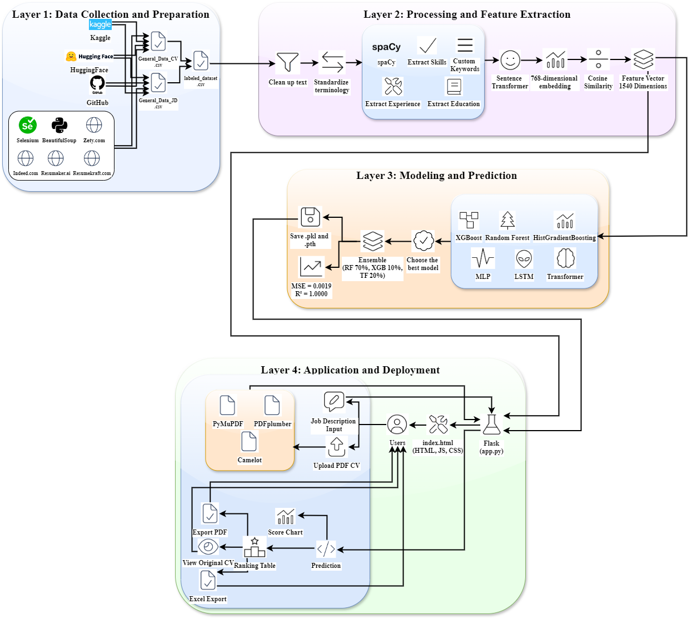

# Hệ Thống Xếp Hạng CV Thông Minh Dựa Trên AI

<p align="center">
  
</p>

## Giới thiệu

Hệ thống xếp hạng CV thông minh là một ứng dụng tiên tiến sử dụng trí tuệ nhân tạo (AI) để tự động đánh giá và xếp hạng các sơ yếu lý lịch (CV) dựa trên mức độ phù hợp với mô tả công việc (JD - Job Description). Ứng dụng tận dụng các kỹ thuật xử lý ngôn ngữ tự nhiên (NLP), học máy (Machine Learning) và học sâu (Deep Learning) để tối ưu hóa quy trình tuyển dụng, đặc biệt trong ngành công nghệ thông tin (CNTT).

Dự án được phát triển nhằm giải quyết thách thức sàng lọc CV thủ công tốn thời gian và dễ sai sót.

## Kiến trúc hệ thống

<p align="center">
  
</p>

Hệ thống được thiết kế theo kiến trúc 4 lớp:
- **Lớp 1 - Thu thập và chuẩn bị dữ liệu:** Crawl dữ liệu CV/JD từ nhiều nguồn (Kaggle, HuggingFace, GitHub, các website tuyển dụng).
- **Lớp 2 - Xử lý và trích xuất đặc trưng:** Làm sạch văn bản, chuẩn hóa thuật ngữ, trích xuất kỹ năng/kinh nghiệm/học vấn bằng spaCy NER, vector hóa bằng Sentence Transformer.
- **Lớp 3 - Mô hình và dự đoán:** Ensemble model kết hợp Random Forest (70%), XGBoost (10%), Transformer (20%).
- **Lớp 4 - Ứng dụng và triển khai:** Giao diện web Flask với chức năng upload PDF, xếp hạng, xuất Excel/PDF.

## Tính năng chính

- **Thu thập dữ liệu:** Thu thập 35,591 cặp CV/JD từ Kaggle, GitHub, Hugging Face, và crawl từ zety.com, myperfectresume.com, tealhq.com, resumeworded.com, naukri.com,...
- **Tiền xử lý văn bản:** Loại bỏ email, URL, số điện thoại; chuẩn hóa thuật ngữ CNTT với từ điển 300+ từ khóa.
- **Trích xuất đặc trưng NER:** Sử dụng spaCy để trích xuất kỹ năng (skills), kinh nghiệm (experience), học vấn (education).
- **Vector hóa:** Sentence Transformer (all-mpnet-base-v2) tạo embedding 768 chiều, kết hợp cosine similarity và đặc trưng NER thành vector 1540 chiều.
- **Mô hình Ensemble:** Kết hợp Random Forest (70%), XGBoost (10%), Transformer (20%) — MSE = 0.0019, R² = 1.0000.
- **Xử lý PDF đa lớp:** Trích xuất nội dung từ CV PDF bằng pdfplumber → PyMuPDF fallback → Camelot (bảng).
- **Xếp hạng CV:** Dự đoán điểm số (0-100), sắp xếp theo thứ tự ưu tiên, phân tích chi tiết kỹ năng phù hợp.
- **Giao diện web:** Upload JD + CV PDF, hiển thị bảng xếp hạng động, biểu đồ điểm số (Chart.js), xuất file Excel/PDF.

## Cấu trúc dự án

```
He-Thong-Xep-Hang-CV-Thong-Minh/
├── TEST/                              # Source chính của hệ thống
│   ├── app.py                         # Flask web application
│   ├── setup_data.ipynb               # Notebook chuẩn bị dữ liệu & gán nhãn
│   ├── Training_Model_Resume_Ranking.ipynb  # Notebook huấn luyện mô hình
│   ├── InputJDinUI.txt                # JD mẫu để test
│   ├── training_log.txt               # Log quá trình huấn luyện
│   ├── datasets/                      # Dữ liệu
│   │   ├── General_Data_CV.xlsx       # Dữ liệu CV tổng hợp
│   │   ├── General_Data_JD.xlsx       # Dữ liệu JD tổng hợp
│   │   └── labeled_dataset.csv        # Tập dữ liệu đã gán nhãn
│   ├── embeddings/                    # Vector embeddings
│   │   ├── cv_embeddings.npy          # Embedding CV
│   │   └── jd_embeddings.npy          # Embedding JD
│   ├── model/                         # Mô hình đã huấn luyện
│   │   ├── rf_model.pkl               # Random Forest
│   │   ├── xgb_model.pkl              # XGBoost
│   │   ├── hgb_model.pkl              # HistGradientBoosting
│   │   ├── transformer_model_best.pth # Transformer (best)
│   │   ├── lstm_model_best.pth        # LSTM (best)
│   │   ├── mlp_model_best.pth         # MLP (best)
│   │   └── rf_xgb_transformer_model.pth # Ensemble model
│   ├── templates/
│   │   └── index.html                 # Giao diện web
│   ├── static/                        # Tài nguyên tĩnh
│   │   ├── anh1.jpg                   # Background
│   │   └── cv.png                     # Favicon
│   ├── PDFexample/                    # CV PDF mẫu để test
│   └── uploads/                       # Thư mục upload tạm
├── NLPResumeRankingAutomatedSystem/   # Phiên bản trước (tham khảo)
├── Automated-Resume-Ranking-System-main/ # Dữ liệu crawl & tiền xử lý
│   ├── Contacts/                      # Scripts crawl dữ liệu
│   └── csvfiles/                      # Dữ liệu CSV đã crawl
├── images/                            # Hình ảnh cho README
└── README.markdown                    # Tài liệu dự án
```

## Công nghệ sử dụng

| Lĩnh vực | Công nghệ |
|-----------|-----------|
| **Ngôn ngữ** | Python 3.11.9+ |
| **NLP** | spaCy, NLTK, Sentence Transformers (all-mpnet-base-v2) |
| **Machine Learning** | Scikit-learn (Random Forest, HistGradientBoosting), XGBoost |
| **Deep Learning** | PyTorch (Transformer, LSTM, MLP) |
| **Xử lý PDF** | pdfplumber, PyMuPDF (fitz), Camelot, PyPDF2 |
| **Web Framework** | Flask, Jinja2 |
| **Frontend** | HTML, CSS (Tailwind CSS), JavaScript, Chart.js |
| **Thu thập dữ liệu** | Selenium, Beautiful Soup |
| **Khác** | NumPy, Pandas, Matplotlib, Joblib, Logging |

## Yêu cầu cài đặt

- **Python:** Phiên bản 3.11 hoặc cao hơn
- **CUDA:** GPU NVIDIA (khuyến nghị) hoặc CPU
- **Thư viện phụ thuộc:**
  ```bash
  pip install flask numpy pandas scikit-learn xgboost torch sentence-transformers
  pip install spacy nltk pdfplumber PyMuPDF camelot-py[cv] PyPDF2 joblib matplotlib
  python -m spacy download en_core_web_sm
  ```

## Hướng dẫn cài đặt và chạy

1. **Clone repository:**
   ```bash
   git clone https://github.com/thanhdat27110382/He-Thong-Xep-Hang-CV-Thong-Minh.git
   cd He-Thong-Xep-Hang-CV-Thong-Minh
   ```

2. **Cài đặt môi trường:**
   ```bash
   python -m venv venv
   # Linux/Mac:
   source venv/bin/activate
   # Windows:
   venv\Scripts\activate

   pip install flask numpy pandas scikit-learn xgboost torch sentence-transformers
   pip install spacy nltk pdfplumber PyMuPDF camelot-py[cv] PyPDF2 joblib matplotlib
   python -m spacy download en_core_web_sm
   ```

3. **Chuẩn bị dữ liệu (nếu huấn luyện lại):**
   - Dữ liệu đã có sẵn trong `TEST/datasets/`.
   - Chạy `TEST/setup_data.ipynb` để tạo `labeled_dataset.csv` (nếu cần tạo lại).

4. **Huấn luyện mô hình (tùy chọn):**
   - Mô hình đã huấn luyện sẵn trong `TEST/model/`.
   - Chạy `TEST/Training_Model_Resume_Ranking.ipynb` để huấn luyện lại.

5. **Chạy ứng dụng web:**
   ```bash
   cd TEST
   python app.py
   ```
   - Mở trình duyệt tại `http://localhost:5000`.

## Cách sử dụng

1. Truy cập `http://localhost:5000`
2. Nhập mô tả công việc (JD) vào ô "Job Description"
3. Tải lên các CV (file PDF, tối đa 200MB) bằng nút "Upload CVs"
4. Nhấn **"Upload and Rate"** để xếp hạng
5. Xem kết quả:
   - **Bảng xếp hạng** với điểm số và phân tích chi tiết
   - **Biểu đồ điểm số** trực quan
   - **Xuất file** Excel hoặc PDF
6. Nhấn **"Reset"** để xóa dữ liệu và bắt đầu lại

## Kết quả nổi bật

| Chỉ số | Giá trị |
|--------|---------|
| **MSE** | 0.0019 |
| **R²** | 1.0000 |
| **Tốc độ** | 32 CV trong ~6 giây |
| **Khả năng mở rộng** | 1,000 CV trong ~4.5 phút |

## Hướng phát triển

- Tích hợp GPU tăng tốc xử lý
- Hỗ trợ đa ngôn ngữ (tiếng Việt, tiếng Nhật,...)
- Triển khai trên cloud (AWS/GCP/Azure)
- Tích hợp hệ thống feedback từ nhà tuyển dụng

## Giấy phép

Dự án được phát hành dưới giấy phép [MIT License](LICENSE).

## Tác giả

- **Tác giả:** Thanh Dat
- **GitHub:** [thanhdat27110382](https://github.com/thanhdat27110382)
- **Ngày cập nhật:** 24/03/2026

## Lưu ý

- Đảm bảo dữ liệu đầu vào có chất lượng tốt để đạt hiệu quả tối ưu.
- Yêu cầu GPU NVIDIA với CUDA để chạy mô hình (có thể chạy trên CPU nhưng chậm hơn).
- Báo cáo lỗi hoặc đề xuất cải tiến qua [Issues](https://github.com/thanhdat27110382/He-Thong-Xep-Hang-CV-Thong-Minh/issues) trên GitHub.